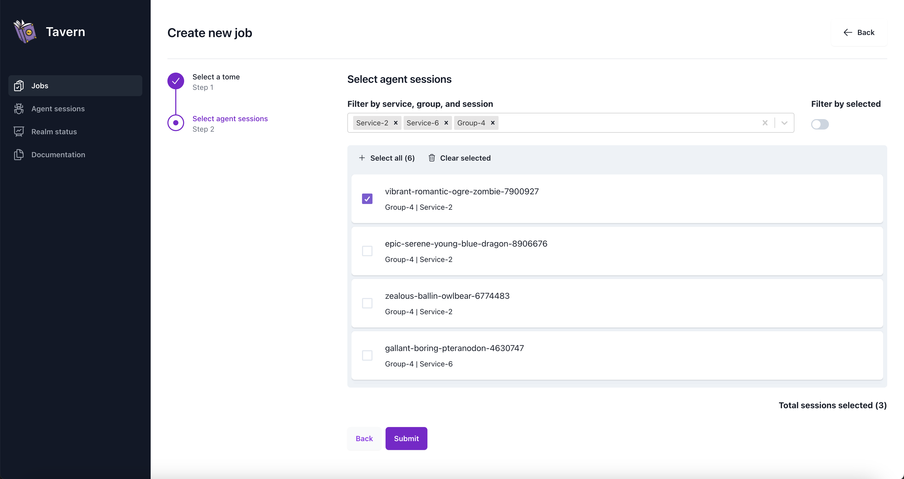

<div align="center">
 
</div>

# Realm

[](https://app.codecov.io/github/kcarretto/realm)
[](https://goreportcard.com/report/github.com/kcarretto/realm)
[](https://rust-reportcard.xuri.me/report/github.com/kcarretto/realm)
[](https://docs.realm.pub/)


Realm is a cross platform Red Team engagement platform with a focus on automation and reliability. 



## Features
### Agent (imix)
- Written in rust with support for MacOS, Linux, and Windows.
- Supports long running jobs by reading output from jobs in real time.
- Interval callback times.
- Simple file based configuration.
- Embedded files.
- Built-in interpreter.

### Server (tavern)
- Web interface.
- Group actions.
- graphql backend for easy API access.
- OAuth login support.
- Cloud native deployment with pre-made terraform for production deployments.


### Built-in interpreter (eldritch)
- Reflective DLL Loader.
- Port scanning.
- Remote execution over SSH.
- And much much more: https://docs.realm.pub/user-guide/eldritch

## Quickstart guide
*To deploy a production ready instance see the [tavern setup guide](https://docs.realm.pub/user-guide/tavern).*
### Start the server
```bash
git clone https://github.com/KCarretto/realm.git
cd realm
go run ./tavern

# If you'd like to test without deploying an agent use the test data.
ENABLE_TEST_DATA=1 go run ./tavern
```
### Start the agent
```bash
git clone https://github.com/KCarretto/realm.git
cd realm/implants/imix

# Create the config file
cat <<EOF > /tmp/imix-config.json
{
    "service_configs": [],
    "target_forward_connect_ip": "127.0.0.1",
    "target_name": "test1234",
    "callback_config": {
        "interval": 4,
        "jitter": 1,
        "timeout": 4,
        "c2_configs": [
        {
            "priority": 1,
            "uri": "http://127.0.0.1/graphql"
        }
        ]
    }
}
EOF

cargo run -- -c /tmp/imix-config.json

```


## Want to contribute start here
https://docs.realm.pub/dev-guide/introduction
